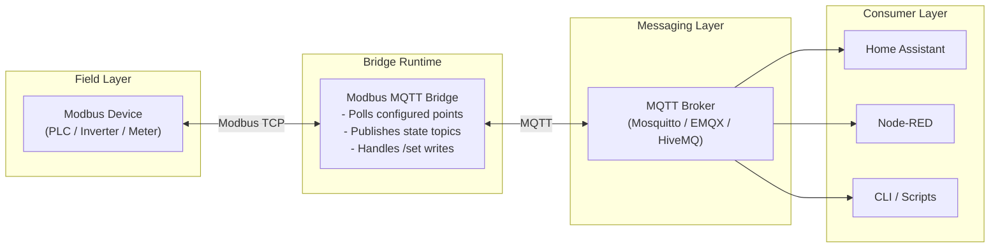

# Architecture

The bridge sits between Modbus TCP devices and MQTT consumers.

## Data flow

1. The bridge polls Modbus points from one or more sources.
2. Values are decoded and published to MQTT state topics.
3. Write commands are received on matching `/set` topics.
4. The bridge encodes and writes values back to Modbus.

## Design goals

- isolate each Modbus source in its own poll loop
- keep topic structure stable and predictable
- recover gracefully from transient broker/device failures
